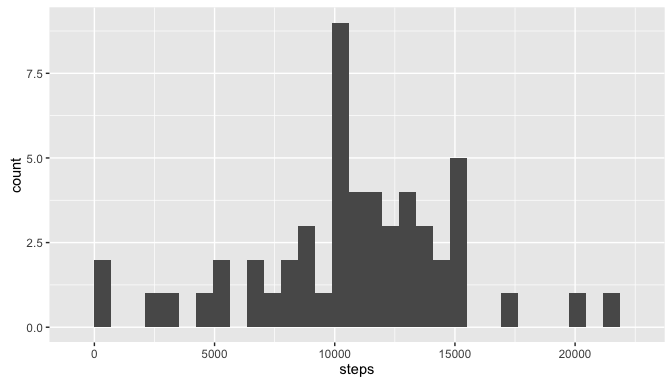
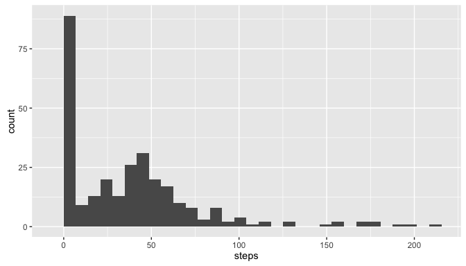

# Reproducible Research: Peer Assessment 1

```r
library(ggplot2)
```

## Loading and preprocessing the data


```r
# 1. Load the data (i.e. 𝚛𝚎𝚊𝚍.𝚌𝚜𝚟())
rawActivity <- read.csv("activity.csv", col.names = list("steps", "date", "interval"))

# 2. Process/transform the data (if necessary) into a format suitable for your analysis
complete <- rawActivity[complete.cases(rawActivity),]
complete$weekdays <- weekdays(as.Date(complete$date))
```

## What is mean total number of steps taken per day?

Below is a graph of the total steps per day


```r
# 1. Calculate the total number of steps taken per day
stepsPerDay <- aggregate(x = complete$steps, by = list(complete$date), sum)
colnames(stepsPerDay) <- c("date", "steps")

# 2. If you do not understand the difference between a histogram and a barplot, research the difference between them. Make a histogram of the total number of steps taken each day
ggplot(stepsPerDay, aes(steps)) + geom_histogram()
```

```
## `stat_bin()` using `bins = 30`. Pick better value with `binwidth`.
```



```r
# 3. Calculate and report the mean and median of the total number of steps taken per day
meanSteps <- mean(stepsPerDay$steps)
medianSteps <- median(stepsPerDay$steps)
```

The mean number of steps per day is 10766

The median number of steps per day is 10765

## What is the average daily activity pattern?


```r
# 1. Make a time series plot (i.e. 𝚝𝚢𝚙𝚎 = "𝚕") of the 5-minute interval (x-axis) and the average number of steps taken, averaged across all days (y-axis)
stepsByInterval <- aggregate(x = complete$steps, by = list(complete$interval), mean)
colnames(stepsByInterval) <- c("interval", "steps")
ggplot(stepsByInterval, aes(x = interval, y = steps)) + geom_line()
```


```r
# 2. Which 5-minute interval, on average across all the days in the dataset, contains the maximum number of steps? 
maxInterval <- stepsByInterval[stepsByInterval$steps == max(stepsByInterval$steps), ]$interval
```

The 5 minute interval with the maximal average steps is 835

## Imputing missing values

Fill NA step values with the mean value for that row's day of week and interval


```r
# 1. Calculate and report the total number of missing values in the dataset (i.e. the total number of rows with 𝙽𝙰s)
missingValues <- length(which(!complete.cases(rawActivity)))

# 2. Devise a strategy for filling in all of the missing values in the dataset. The strategy does not need to be sophisticated. For example, you could use the mean/median for that day, or the mean for that 5-minute interval, etc.
meanWeekDayInterval <- aggregate(complete$steps, by = list(complete$interval, complete$weekdays), mean)
colnames(meanWeekDayInterval) <- list("interval", "weekdays", "steps")

# 3. Create a new dataset that is equal to the original dataset but with the missing data filled in.
filled <- rawActivity
filled$weekdays <- weekdays(as.Date(filled$date))
# there must be a more elegant way to do this
for (i in 1:nrow(filled)) {
  row = filled[i, ]
  if (is.na(row$steps)) {
      filled[i, ]$steps <- meanWeekDayInterval[meanWeekDayInterval$weekdays == row$weekdays & meanWeekDayInterval$interval == row$interval, ]$steps
  }
}
# 4. Make a histogram of the total number of steps taken each day and Calculate and report the mean and median total number of steps taken per day. Do these values differ from the estimates from the first part of the assignment? What is the impact of imputing missing data on the estimates of the total daily number of steps?
filledByInterval <- aggregate(x = filled$steps, by = list(filled$interval), mean)
colnames(filledByInterval) <- list("interval", "steps")
ggplot(filledByInterval, aes(steps)) + geom_histogram()
```

```
## `stat_bin()` using `bins = 30`. Pick better value with `binwidth`.
```



## Are there differences in activity patterns between weekdays and weekends?


```r
# 1.  Create a new factor variable in the dataset with two levels – “weekday” and “weekend” indicating whether a given date is a weekday or weekend day.
weekFactors <- ifelse(filled$weekdays == 'Saturday' | filled$weekdays == 'Sunday', "weekend", "weekday")
filled$week <- as.factor(weekFactors)

# 2. Make a panel plot containing a time series plot (i.e. 𝚝𝚢𝚙𝚎 = "𝚕") of the 5-minute interval (x-axis) and the average number of steps taken, averaged across all weekday days or weekend days (y-axis). See the README file in the GitHub repository to see an example of what this plot should look like using simulated data.
meanStepsTaken <- aggregate(filled$steps, by = list(filled$interval, filled$week), mean)
colnames(meanStepsTaken) <- list("interval", "week", "steps")
ggplot(meanStepsTaken, aes(x = interval, y = steps)) + geom_line() + facet_grid(. ~ week)
```


